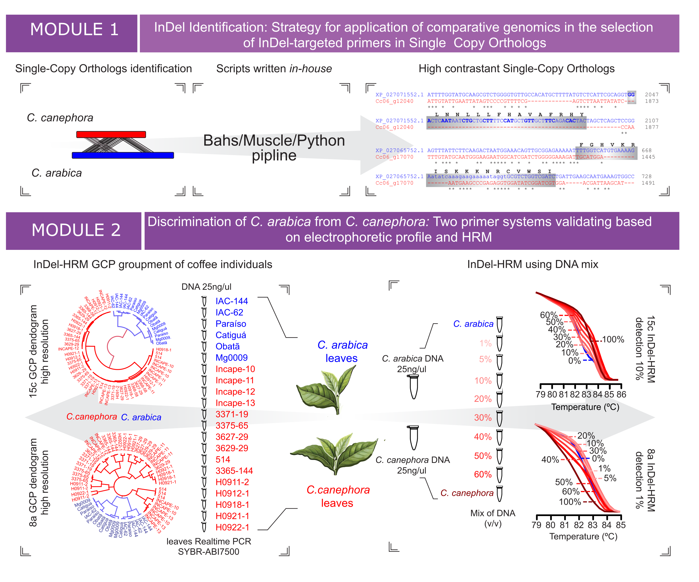

# Repository for Genetic Target selection, Authentication and Diagnosis
This repository is dedicated to genetic target selection and analysis for product authentication and diagnosis in a broader context. It also provides an R module focused on High Resolution Melting (HRM) analysis as an approach to contrast or diagnose samples.

**Objectives**
- *Python Module to Genetic Target Selection*: The main code used in this module is located in the directory target_selection/compartative_genomics/singletons_to_primers.py. The documentation for this module will be described soon. Essentially, this module is responsible for the identification of genomic regions that can be used as markers for product authentication and sample diagnosis.
- *High Resolution Melting (HRM) Analysis*: Providing tools in R for HRM analysis, facilitating the comparison and diagnosis of different samples based on DNA melting characteristics.

<div style="text-align: center;">
  
</div>

<p align="center">
  
</p>

## GENETIC TARGET SELECTION
Documentation in progress
## MODULE TO HRM ANALYSIS

This module is based on an R script (hrm_analysis/m144.R) for performing High-Resolution Melting (HRM) analysis on the first derivative of fluorescence obtained from a real-time PCR. The script processes the data, calculates dissimilarity matrices, performs hierarchical clustering based on Genotype Confidence Percentage (GCP), and generates main plots (see below).

## GETTING STARTED
```
git clone https://github.com/your_username/your_repository.git
```
## DEPENDENCES

The script requires the following R packages. You can install them using the commands below:

```r
install.packages("tidyr")
if (!require("processx")) install.packages("processx")
install.packages("MBmca")

# Additionally, load the necessary libraries
library(ggplot2)
library(factoextra)
library(dendextend)
library(cluster)
library(ape)
library(circlize)
library(qpcR)
library(tidyverse)
library(plotly)
library(MBmca)
library(RColorBrewer)
```
The melting curve graphs will be plotted with the `Plotly` package, which can be exported using the additional orca command line [utility](https://github.com/plotly/orca). First, you need to install the orca library on your operating system (for details, see the [link](https://github.com/plotly/orca#installation)).

## SCRIPT OVERVIEW
### Data Loading and Filtering
Reads the HRM raw data from a file located at `../data/M144_Raw_Data.txt`.
Filters the data based on specific temperature ranges (**77°C** to **84°C**) and adjusts column names for consistency.

### Melt Curve Analysis
Performs melt curve analysis to normalize the data and extract fluorescence values. This analysis is used to adjust for baseline shifts and to compute fluorescence intensities.

### Dissimilarity Calculation
- Computes a dissimilarity matrix considering genotype confidence percentage. This matrix quantifies the differences between - - samples based on their HRM profiles.

### Calculation of Genotype Confidence Percentage (GCP)

According to [Nunziata et al (2018)](https://doi.org/10.1016/j.plgene.2018.04.006) "Genotype confidence percentage (GCP) of HRM curves is the most commonly used statistical
transformation of Euclidean distance between HRM curves to determine whether two curves are identical or not.". A better explanation of the procedure for calculating GCP is described below:

1. **Calculation of a similarity matrix ():**

   The formula is:
   ^{2}})

   **Explanation:**
   -  is a measure of similarity.
   - The base of the exponentiation is
     
   - The coefficient that adjusts the influence of the sum of squared differences is
     
   - The summation spans an index range  from  to : 
     
   - The term ^{2}) is the square of the difference between the fluorescence values  and  for each index 
   - The result of the summation is multiplied by \( -0.02 \) and used as the exponent for \( 1.05 \):
     ^{2}})

2. **Calculation of a dissimilatiry matrix ():**

   The formula is: %20*%20100)

   **Explanation:**
   -  is the measure of dissimilarity.
   - It is calculated as the difference between 1 and , multiplied by 100 to convert it into a percentage:
     %20*%20100)
   - The higher the value of , the greater the dissimilarity between the fluorescence profiles.

The vlaues of  and   are calculated by the script `hrm_analysis/m144.R`  and a dissimilarity matrix is saved in the dissimilarity.txt file.

### Hierarchical Clustering
- Performs hierarchical clustering on the dissimilarity matrix using average linkage method.
- Generates a dendrogram plot to visualize the clustering results.
- Saves the dendrogram plot as `M144.pdf`.
  
### Cluster Identification and Visualization
- Identifies clusters in the hierarchical clustering results and assigns colors to each cluster.
- Generates a line plot of the HRM data, color-coded by cluster, to show the fluorescence data across different temperature ranges.
- Saves the line plot as `df_M144.pdf`.

## USAGE
Place your HRM data file in the `../data/` directory. The example file used is named M144_Raw_Data.txt. You can use the same name for your file, or if you choose a different name, make sure to update the filename on line 22 of the code (`hrm_analysis/m144.R`).

Run the R script to process the data, calculate dissimilarity, perform clustering, and generate plots.

## INPUT
An example of real data to be used as input can be found in the data directory `../data/M144_Raw_Data.txt`. The file should be in `tsv` format. This dataset corresponds to the first derivative of fluorescence obtained from a real-time PCR run on the LightCycler® equipment. Below is a sample format where the first column should be the melting curve temperature and the remaining columns should contain the respective fluorescence values for each sample. In the example shown here, the data is already in the first derivative of the fluorescence.

|   Temp   | Sample1 | Sample2 | Sample3 | Sample4 | Sample5 | Sample6 | Sample7 |
|:--------:|:-------:|:-------:|:-------:|:-------:|:-------:|:-------:|:-------:|
|  59.540  |  1.953  |  1.895  |  1.813  |  1.722  |  1.632  |  2.538  |  2.032  |
|  59.817  |  1.953  |  1.895  |  1.813  |  1.722  |  1.632  |  2.538  |  2.032  |
|  60.094  |  2.309  |  2.139  |  2.168  |  2.050  |  1.986  |  2.873  |  2.265  |
|  60.371  |  2.763  |  2.445  |  2.648  |  2.510  |  2.490  |  3.338  |  2.623  |
|  60.649  |  3.151  |  2.689  |  3.095  |  2.928  |  2.937  |  3.727  |  2.923  |
|  60.926  |  3.363  |  2.826  |  3.348  |  3.137  |  3.154  |  3.903  |  3.026  |
|  61.203  |  3.371  |  2.816  |  3.351  |  3.117  |  3.136  |  3.870  |  2.952  |
|  61.480  |  3.248  |  2.673  |  3.212  |  2.970  |  2.979  |  3.707  |  2.794  |
|  61.757  |  3.144  |  2.535  |  3.107  |  2.845  |  2.861  |  3.559  |  2.681  |
|   ...    |   ...   |   ...   |   ...   |   ...   |   ...   |   ...   |   ...   |


## OUTPUT

- `dissimilaridade.txt` for the dissimilarity matrix which includes the effect of genotype confidence percentage.
- `M144.pdf`:
Shows the hierarchical clustering results as a dendrogram. The plot illustrates how samples are grouped into clusters based on their dissimilarity scores. For now, we suggest you check this file to select the number of K-means clusters and then choose the number of clusters. In our example, we selected `k=2` (see the `k` on line 122 of the script `hrm_analysis/m144.R`).
- `df_M144.pdf`:
Displays the `-dF/dT` of fluorescence data against the shift temperature for each sample. This step will require future optimization, as it currently depends on user adjustments. Therefore, be attentive and choose the best temperature shift for your data.

## NOTES
- Ensure that all necessary R packages are installed.
- The script assumes that the HRM data file is formatted correctly and located in the specified directory.
- Adjust the script as needed for different data formats or analysis requirements.
